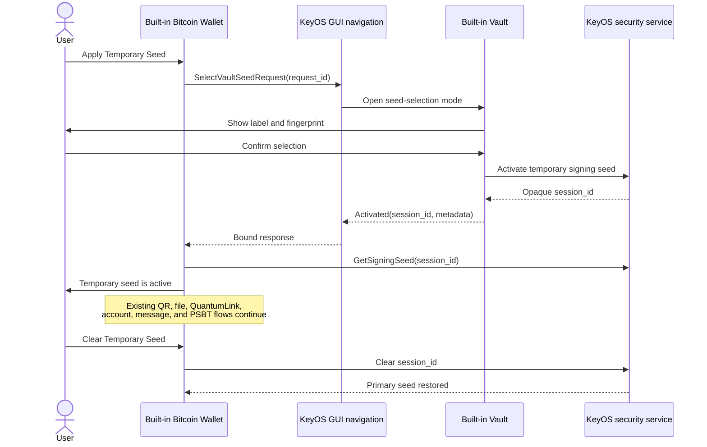

# Architecture

## Decision summary

Vault Signer should extend Foundation's built-in Vault and Bitcoin Wallet rather than become a third wallet app. This preserves the existing signing parser, account model, multisig support, passphrases, address verification, transport handlers, and Foundation-controlled permission boundary.

The standalone SDK app in this repository is only a UX and protocol prototype. It intentionally cannot access the built-in Vault.

## Proposed component flow

This is a proposed design, not a claim about current KeyOS behavior.

## Trust boundaries

### Third-party app boundary

An ordinary SDK app cannot read another app's `AppData` filesystem scope. In the reviewed source, `AppData` is mapped using the calling process's app ID; `User` is a separate shared user-files location. An app also cannot use Foundation-reserved master-seed, PIN, backup, Keycard, or NFC read/write operations. Vault Signer must not weaken those defaults by adding broad permissions to the public SDK app.

### Foundation app boundary

The built-in Vault already handles imported mnemonic entropy and BIP85-derived seeds. The built-in Bitcoin Wallet already receives the device seed and owns signing flows. The narrow change is to let a user authorize one Vault seed as the Bitcoin Wallet's temporary signing source without exporting that seed through a public app protocol.

### Security-service boundary

The recommended implementation gives the KeyOS security service ownership of the temporary session. The Vault supplies the chosen seed to this Foundation-only service; GUI navigation returns only an opaque session ID and non-secret display metadata. The Bitcoin Wallet requests the active signing seed from the security service.

This requires Foundation review because it changes a highly sensitive service. A simpler response containing entropy would copy seed material through the GUI server and its serialization buffers and is rejected by this design.

## Lifecycle

1. **Primary** — the Bitcoin Wallet uses the normal device seed.
2. **Activating** — a request ID binds the Bitcoin request to one Vault response.
3. **Temporary** — an opaque session ID and fingerprint identify the active in-memory seed.
4. **Clearing** — KeyOS prevents new signing, zeroizes the session, unloads derived private state, then returns to Primary.

Power loss or shutdown must behave like a successful clear. Lock behavior requires Foundation input: the safest initial rule is to clear on lock, even if that is stricter than the existing temporary-seed documentation.

The prototype requires an existing temporary session to be cleared before another activation begins. It does not mark the primary seed active until the security service confirms the matching session was cleared. An ambiguous result therefore remains non-signing.

## Existing functionality

The feature belongs inside the built-in Bitcoin Wallet specifically so all existing input/output paths share one parser and policy engine:

- QR and animated UR input/output;
- file import/export through scoped KeyOS file services;
- QuantumLink requests and responses;
- single-signature and multisignature accounts;
- passphrases;
- address verification and account export;
- message and PSBT signing.

NFC behavior must remain whatever the Foundation-signed Bitcoin Wallet and KeyOS version officially support. This project will not claim NFC parity until a device test demonstrates it.
